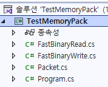

# 테스트
- 활용 방법이나 SuperSocketLite의 기능을 테스트 한다.   
      
  
## SuperSocketLiteRegressionTests
- 라이브러리 자체의 회귀 테스트이다. 현재 40건.  
- xUnit이 아니라 `Program.cs`의 배열에 (이름, 함수)를 넣고 차례로 돌리는 자체 러너이다. 하나라도 실패하면 종료 코드 1을 돌려준다.  
- 수신 필터, 송신 큐, 로깅, 그리고 실제로 루프백 서버를 띄워서 보는 것까지 한 프로세스에서 확인한다.  
```
dotnet run --project Test/SuperSocketLiteRegressionTests -c Release
```
  
  
## LoadTest
- 부하 테스트 스위트이다. 계측 서버, 더미 클라이언트, 리포트·회귀 판정 도구, DuckDB 분석 SQL, 실행 스크립트가 들어 있다.  
- 스위트 자체를 검증하는 테스트가 110건 있다.  
```
dotnet run --project Test/LoadTest/SuperSocketLite.LoadTest.Tests -c Release
```
- 빌드, 실행, 결과 확인 방법은 [`LoadTest/BUILD_AND_USAGE.md`](./LoadTest/BUILD_AND_USAGE.md)를 본다.  
  
  
## TestServer
- `EFBinaryRequestInfo`를 사용하는 간단한 에코 서버이다. `TestClient`의 상대역이다.  
  
  
## TestClient
- WinForms로 만든 수동 테스트용 클라이언트이다. 접속, 전송, 수신을 화면에서 눌러 가며 확인한다.  
  
  
## TestMemoryPack
    
  
- 직렬화 라이브러리인 `MemoryPack` 사용 예제 코드 
- 네트워크 프로그램의 패킷으로 사용할 때의 코드도 있다  
```
void Test6()
{
    Console.WriteLine("[ Test 6 ] 패킷 데이터 직렬화");

    var reqPkt = new PKTReqLogin
    {
        TotalSize = 0, // 여기에서는 패킷의 전체 크기를 알 수 없다
        Id = 22,
        Type = 0,
        UserID = "jacking75",
        AuthToken = "jacking75",
    };
    // 직렬화 하면 앞에 1 바이트는 갯수, 이후는 데이터 순서대로 직렬화한다
    var bin = MemoryPackSerializer.Serialize(reqPkt);
    var totalSize = (UInt16)bin.Length;
    Console.WriteLine($"[Test6] Packet bin Size: {totalSize}");

    // PKTReqLogin 초기화에서 패킷의 전체 크기를 0으로 했기 때문에 올바르게 수정한다
    FastBinaryWrite.UInt16(bin, 1, totalSize);
    

    // 패킷 헤더 정보 읽기
    var headerInfo = new MemoryPackPacketHeadInfo();
    headerInfo.Read(bin);
    headerInfo.DebugConsolOutHeaderInfo();


    var obj = MemoryPackSerializer.Deserialize<PKTReqLogin>(bin);

    if (obj != null)
    {
        Console.WriteLine($"{obj.UserID}:{obj.AuthToken}");

        if (obj.Id == reqPkt.Id && obj.AuthToken == reqPkt.AuthToken)
        {
            Console.WriteLine("OK - Test6");
        }
    }
}
```  
  
```
[MemoryPackable]
public partial class PkHeader
{
    public UInt16 TotalSize { get; set; } = 0;
    public UInt16 Id { get; set; } = 0;
    public byte Type { get; set; } = 0;
}

// 로그인 요청
[MemoryPackable]
public partial class PKTReqLogin : PkHeader
{
    public string UserID { get; set; } = default!;
    public string AuthToken { get; set; } = default!;
}

[MemoryPackable]
public partial class PKTResRoomEnter : PkHeader
{
    public Int16 ErrorCode { get; set; }
    public int RoomNumber { get; set; }
}
```  
    
```
public struct MemoryPackPacketHeadInfo
{
    const int PacketHeaderMemoryPackStartPos = 1;
    public const int HeadSize = 6;

    public UInt16 TotalSize;
    public UInt16 Id;
    public byte Type;

    public static UInt16 GetTotalSize(byte[] data, int startPos)
    {
        return FastBinaryRead.UInt16(data, startPos + PacketHeaderMemoryPackStartPos);
    }

    public static void WritePacketId(byte[] data, UInt16 packetId)
    {
        FastBinaryWrite.UInt16(data, PacketHeaderMemoryPackStartPos + 2, packetId);
    }

    public void Read(byte[] headerData)
    {
        var pos = PacketHeaderMemoryPackStartPos;

        TotalSize = FastBinaryRead.UInt16(headerData, pos);
        pos += 2;

        Id = FastBinaryRead.UInt16(headerData, pos);
        pos += 2;

        Type = headerData[pos];
        pos += 1;
    }

    public void Write(byte[] mqData)
    {
        var pos = PacketHeaderMemoryPackStartPos;

        FastBinaryWrite.UInt16(mqData, pos, TotalSize);
        pos += 2;

        FastBinaryWrite.UInt16(mqData, pos, Id);
        pos += 2;

        mqData[pos] = Type;
        pos += 1;
    }

    
    public void DebugConsolOutHeaderInfo()
    {
        Console.WriteLine("DebugConsolOutHeaderInfo");
        Console.WriteLine("TotalSize : " + TotalSize);
        Console.WriteLine("Id : " + Id);
        Console.WriteLine("Type : " + Type);
    }   
}
```   
  
     
## TestProtocolBuffer
  
- 직렬화 라이브러리인 `Protocol Buffers`(`Google.Protobuf`) 사용 예제 코드  
- 패킷 정의는 `packet_protocol.proto`에 있다. `PacketHeader`(`total_size`, `id`, `value`)를 각 요청 메시지가 첫 필드로 갖는 구조이다.  
  `protoc.exe -I=./ --csharp_out=./ ./packet_protocol.proto` 로 `PacketProtocol.cs`를 만든다.  
```
message PacketHeader {
    fixed32 total_size = 1;
    fixed32 id = 2;
    fixed32 value = 3;
}

message LoginRequest {
    PacketHeader header = 1;
    string user_id = 2;
    string password = 3;
}
```  
  
- 네트워크로 받은 데이터는 전체를 역직렬화하기 전에 헤더만 먼저 봐야 한다. 그 역할을 `ProtocolBufferHeaderParser`가 한다.  
  헤더의 세 필드를 `fixed32`로 선언했기 때문에 직렬화 결과에서 위치가 고정된다. 앞의 3바이트(직렬화 메타 정보)를 건너뛴 뒤 4바이트씩 읽으면 되고,
  필드 사이에 1바이트 태그가 끼므로 읽은 다음에는 4가 아니라 5를 더한다.  
- `WritePacketHeaderTotalSize`는 직렬화가 끝나야 알 수 있는 전체 크기를 그 자리에 직접 덮어쓴다.  
- **주의**: 나중에 값을 덮어쓸 필드는 직렬화할 때 0이면 안 된다. Protocol Buffers가 0인 필드를 생략해 버려서 덮어쓸 자리 자체가 사라진다.
  그래서 `PacketTest`는 `TotalSize = UInt32.MaxValue`처럼 0이 아닌 더미 값을 넣고 직렬화한다.  
- `PacketTest.cs`에 `LoginRequest`, `MoveRequest`, `SendMailRequest` 세 가지를 대상으로
  (1) 그냥 역직렬화, (2) 헤더의 전체 크기를 덮어쓰고 역직렬화, (3) 헤더만 먼저 읽은 뒤 전체 역직렬화 순서로 확인하는 코드가 있다.  
```
byte[] serialized = loginRequest.ToByteArray();

// 직렬화한 데이터의 헤더 부분을 수동으로 변경한다
uint totalSize = (uint)serialized.Length;
ProtocolBufferHeaderParser.WritePacketHeaderTotalSize(serialized, totalSize);

// 헤더만 먼저 비직렬화 후 전체 비직렬화하기
PacketHeader header = ProtocolBufferHeaderParser.ParseHeaderOnly(serialized);
LoginRequest request = LoginRequest.Parser.ParseFrom(serialized);
```  
  
  